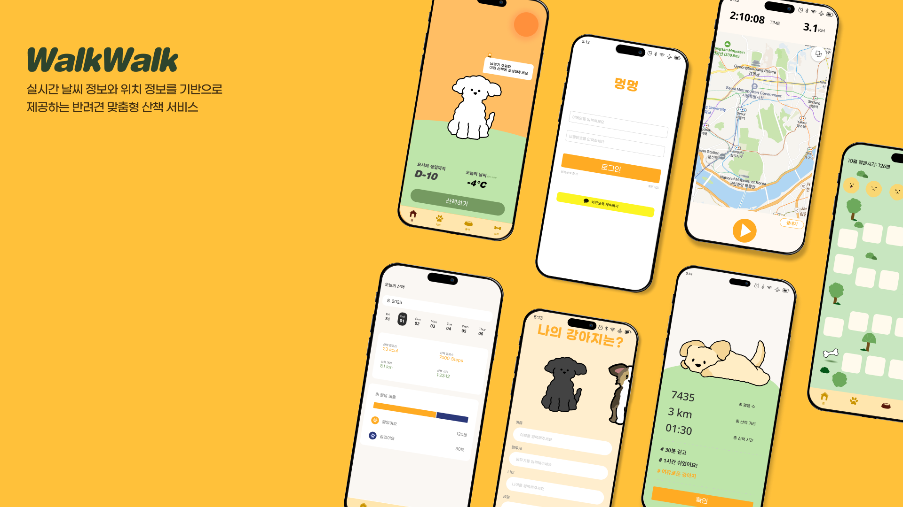

## 🐶 멍멍

날씨,위치 기반 데이터를 활용해
강아지의 산책 패턴을 분석하고 온도 별 맞춤 메세지를 제공합니다.

개인 프로젝트 (기획, 디자인, Android, Backend 단독 개발)

Google Play Store 배포
🔗 Play Store
https://play.google.com/store/apps/details?id=com.withwalk.app

## 주요 기능

## 실시간 산책 기록
- Kakao Map SDK 기반 실시간 경로 표시
- 산책 시간 / 거리 / 걸음 수 실시간 갱신
- 산책 시작 · 일시정지 · 종료 상태 관리

### 산책 패턴 분석
- 위치 이동 속도(location.time 기반)로 산책 유형 분석
- distanceBetween()을 활용한 실제 이동 거리 계산
- GPS accuracy 20m 초과 좌표 제거로 위치 튐 방지

### 날씨 기반 안전 메시지
- 기상청 API 연동 실시간 날씨 정보 제공
- 강아지 체중 + 현재 기온 기반 맞춤 유의 메시지
- 시간대별(아침/점심/저녁) 배경 변경 및 날씨 애니메이션(Lottie)

### 출석
- 산책 완료 시 출석 체크
- 월별 누적 산책 시간·거리 제공
- 출석 이모티콘 및 메시지 유지

## 기술 스택

### Android
- Kotlin
- Jetpack Compose
- Coroutine / StateFlow
- Hilt 
- DataStore

### Backend
- Spring Boot
- MySQL
- Redis
- AWS
- Docker

## 핵심 구현 포인트

1. 실시간 위치 추적 구조

- FusedLocationProviderClient + ForegroundService + LocationCallback
- ForegoundService에서 수집한 데이터를 ViewModel의 StateFlow로 관리
- UI는 collect()를 통해 최신 데이터 반영

2. 다중 Retrofit 인스턴스 분리

- 서버 API + 기상청 API 동시 사용
- 동일 타입(Retrofit) 주입 충돌 문제 발생
- @MainRetrofit, @WeatherRetrofit 커스텀 Qualifier 정의로 해결

## 트러블 슈팅

1. 지도 초기화 지연으로 인한 Crash

### 문제
- Google Play Console에서 UninitializedPropertyAccessException 발생

### 원인
- 지도 SDK 초기화 이전에 위치 데이터 Flow가 먼저 수집됨
- 초기화 타이밍이 보장되지 않아 lateinit KakaoMap 접근 시 크래시 발생

### 해결
- if (!::kakaoMap.isInitialized || path.size < 2) return@collect

### 결과
- 지도 초기화 완료 이후에만 위치 데이터 처리
- Play Console에서 크래시 오류 관찰되지 않음

2. Retrofit DI 충돌

### 문제
- 기상청 API용 Retrofit 추가 시 기존 서버 Retrofit과 타입 중복
- Hilt가 주입 대상 판단 불가 → 컴파일 에러

### 해결
- @Qualifier 기반 커스텀 어노테이션 정의
- API 용도별 Retrofit 인스턴스 분리

### 결과
- 의존성 주입 모호성 해결

3. 비동기 API 중복 호출

### 문제
- 회원가입 버튼 연속 클릭 시 동일 요청 다중 전송
- 서버에 중복 이메일 데이터 저장

### 해결
- 서버: 이메일 Unique 제약 조건 추가
- 클라이언트: loading 상태 관리 + 버튼 비활성화

### 결과
- 중복 요청 차단
- 데이터 무결성 확보
